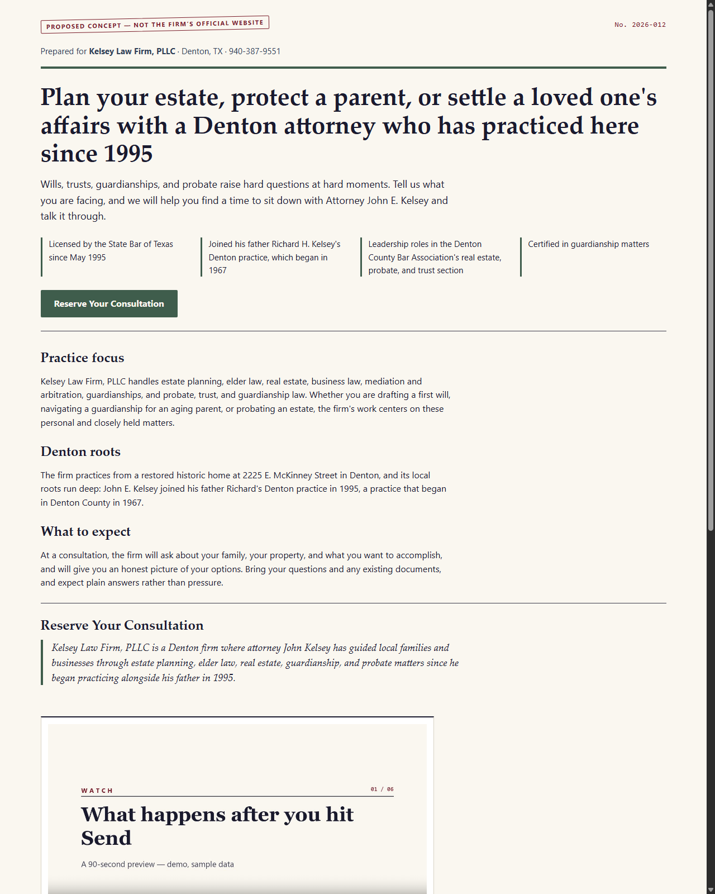
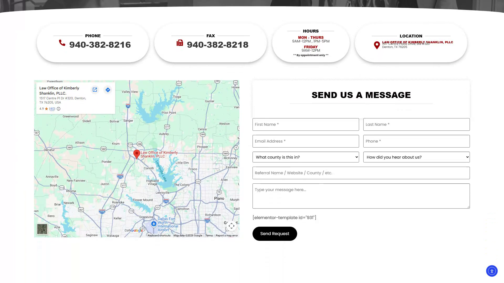

# IntakeBrief end-to-end demo video production plan

Status: completed and verified on 2026-07-17
Final runtime: 54.80 seconds
Master format: 1920x1080, 30 fps, H.264, yuv420p, 16:9
Primary demo surface: `/capture/kelsey-law`
Test inbox: `FGarcia@TLG-works.com` (masked where appropriate in the public cut)

## 1. Outcome

Produce a credible, polished demonstration of the real IntakeBrief workflow:

1. A prospective client opens the law-firm intake page.
2. The client fills out the real form with safe test data.
3. The client submits the inquiry.
4. The firm notification and automated customer response are actually delivered.
5. Real availability is read from Google Calendar.
6. The client selects a time and receives a 15-minute hold.
7. The client enters Stripe's test checkout and pays the fixed $50 test deposit.
8. A signed Stripe webhook confirms the payment and booking.
9. The final screen and confirmation messages prove the workflow completed.

This is a proof video, not a concept animation. Every operational claim shown on screen must be backed by the live test run. Stripe must remain visibly labeled as test mode; no real charge or real client information will be used.

## 2. Scope decision

The main recording will use the IntakeBrief Kelsey Law proposed-concept page because that page is connected to the inquiry, email, calendar, hold, checkout, and webhook code.

The saved Shanklin WordPress contact page is visual reference only. It is not currently connected to IntakeBrief, so the finished video must not imply that submitting Shanklin's existing public form triggers this workflow.

## 3. Visual references

### Live IntakeBrief page

Use this page's visual language throughout the edit: warm paper background, dark editorial serif headings, forest-green actions, thin rules, and burgundy docket stamps.

### Existing Shanklin contact form reference

This frame explains why the earlier video felt disconnected: it shows an existing site form, but the subsequent inbox, calendar, and payment screens were illustrative. The new cut will remain on the connected IntakeBrief surface and show genuine outcomes.

## 4. Visual treatment

- Palette: paper `#F7F3EB`, ink `#11172A`, forest `#365745`, burgundy `#7D1E2D`, muted gold `#B98A44`.
- Typography: editorial serif for titles; clean sans-serif for captions and status labels.
- Step marker: small upper-left docket label, for example `STEP 03 / 08 — FIRM NOTIFIED`.
- Evidence label: small upper-right label, either `LIVE TEST` or `STRIPE TEST MODE`.
- Cursor: normal cursor with one restrained click ring. No oversized cartoon cursor.
- Motion: direct cuts, short 6–8 frame dissolves, and slow 3–5% punch-ins only where a result needs emphasis.
- Browser framing: crop tabs/bookmarks unless the URL establishes trust. Keep the IntakeBrief URL visible during the form submission and Stripe's domain visible during checkout.
- Captions: open captions in the lower safe area, two lines maximum, high contrast, readable with audio muted.
- Privacy: mask secret values, message IDs, tokens, unrelated inbox content, and personal calendar details. Keep the business test inbox visible only when it adds proof.
- Sound: warm professional narration at roughly 145 words per minute, quiet click accents, no loud corporate music. If music is used, keep it 18–22 dB below narration.

## 5. Approved concise shot list

| Time | Picture | On-screen text | Proof captured |
|---|---|---|---|
| 00:00–00:04 | Clean title on paper background, then immediate cut to the live page | `From inquiry to paid consultation — one real workflow` | Establishes the promise without a long logo intro |
| 00:04–00:10 | Live Kelsey page; smooth scroll from the primary CTA to the intake section | `LIVE TEST · SAFE SAMPLE DATA` | Shows the real connected page |
| 00:10–00:24 | Form fields completed at readable speed; message remains brief and non-confidential; both required acknowledgments checked | `1 · CAPTURE THE INQUIRY` | Shows the exact fields and consent controls |
| 00:24–00:29 | Cursor clicks `Send inquiry`; button changes to `Submitting…`; pause on the completed status | `Submitted once — no duplicate send` | Shows the real submit transition |
| 00:29–00:38 | Result block receives a restrained punch-in; highlight accepted firm notification, accepted customer response, and matter classification | `2 · DELIVERY CONFIRMED` | Shows server-reported delivery status |
| 00:38–00:47 | Open the test inbox and the real firm notification; mask unrelated mail; highlight sender, subject, client name, and short inquiry | `3 · FIRM NOTIFIED` | Proves Resend delivery to the controlled inbox |
| 00:47–00:55 | Open the automated client response in the same controlled inbox; show topic-specific wording and next-step link/status | `4 · CLIENT RESPONDED TO` | Proves the customer response was actually sent |
| 00:55–01:06 | Return to the app; real Google Calendar slots appear; select one; show the 15-minute hold and expiry | `5 · REAL AVAILABILITY · 15-MINUTE HOLD` | Proves live free/busy data and local hold state |
| 01:06–01:17 | Click `Reserve with $50 deposit`; Stripe-hosted Checkout opens; show `TEST MODE`, `$50.00`, and completion with Stripe's test card | `6 · SECURE TEST CHECKOUT` | Proves the server-created checkout amount and Stripe-hosted payment surface |
| 01:17–01:24 | Checkout returns to IntakeBrief; show confirmation page and a brief split-screen/overlay of the received `checkout.session.completed` event | `7 · SIGNED WEBHOOK VERIFIED` | Proves the redirect alone was not treated as payment |
| 01:24–01:30 | Final booking confirmation plus a concise end card | `Inquiry received · time held · deposit verified · booking confirmed` | Closes with the completed chain |

## 6. Narration script

> Here is what happens when a potential client contacts the firm through IntakeBrief. We are using safe sample data and Stripe test mode, but the workflow itself is real.
>
> The visitor enters a name, email, phone number, and a short, non-confidential description. They accept the required notices and send the inquiry.
>
> IntakeBrief validates the submission, classifies the matter, and delivers a detailed notification to the firm's controlled inbox. Only after that delivery succeeds does the system send the client an automatic response tailored to the inquiry.
>
> The scheduling step reads current availability from Google Calendar. The client chooses an open time, and IntakeBrief holds it for fifteen minutes so it cannot be offered twice.
>
> To reserve the appointment, the client enters Stripe-hosted Checkout for a fixed fifty-dollar test deposit. Card information never touches the law-firm website.
>
> After Stripe verifies the test payment, a signed webhook confirms the booking. The app records the appointment and sends the final confirmation messages.
>
> One form becomes a delivered lead, a scheduled consultation, and a verified deposit—without retyping the client's information.

## 7. Final production record

The delivered cut uses ten concise, open-captioned proof beats: safe form fill, submission, guardianship routing, the real firm notification, the topical customer reply, live availability and hold, Stripe Sandbox Checkout, the `$50` test payment, the honest verification return, and the final confirmation email. The three email beats use the user-supplied screenshots from the real test run. Narration and music were intentionally omitted after the user requested a less wordy result; the video is designed to work muted.

- Master: `video_build/intakebrief-contact-form-demo.mp4`
- Published website asset: `public/how-it-works.mp4`
- Reproducible render: `video_build/render-demo.ps1`
- Captions: `public/how-it-works-captions.vtt`
- Raw captures: `video_build/raw_recording/`
- SHA-256: `778B969CF9B28FABF85AEC522C14A7EDA76251BF5D03A4331540EB559F2DDE0D`

## 8. Detailed production checklist

### A. Preflight and system proof

- [x] Confirm the refresh token was issued by the same Web Application client ID and secret stored in `.env.local`; direct token refresh now succeeds.
- [x] Re-run `/api/availability`: HTTP 200, `America/Chicago`, 79 real slots, and demo mode absent/false on 2026-07-17.
- [x] Send one controlled inquiry: firm notification and customer response both reported `accepted` after normalizing the test recipient to lowercase.
- [x] Confirm all four workflow messages arrive at `FGarcia@TLG-works.com`: firm inquiry notification, automated customer response, deposit-received firm confirmation, and customer booking confirmation. Visually confirmed by the user on 2026-07-17.
- [x] Keep the Stripe listener running and verify its current `whsec_...` matches `.env.local`.
- [x] Complete one disposable Stripe test checkout: $50.00 Sandbox payment, signed `checkout.session.completed`, webhook HTTP 200, and persisted confirmed booking on 2026-07-17.
- [x] Confirm no real card, real client matter, or third-party inbox is used; Stripe remained in Sandbox and used `4242 4242 4242 4242`.

### B. Capture preparation

- [x] Use the sample client `Jordan Mitchell` and a brief, non-confidential guardianship message.
- [x] Show multiple real Google Calendar choices without exposing event titles.
- [x] Crop every public shot to the active browser window so unrelated desktop content is absent.
- [x] Record at 1920x1080 and render the active browser at full 16:9 resolution.
- [x] Use tightly cropped Gmail views so unrelated email rows do not appear.
- [x] Confirm Stripe remained visibly labeled `Sandbox` throughout checkout.
- [x] Record calibration clips and verify text legibility before the live run.

### C. Live capture

- [ ] Record the entire workflow once without stopping to preserve continuity and timestamps.
- [x] Record a clean take of the form fill and submit with deliberate cursor movement.
- [x] Record separate close-up takes of the delivery status, both emails, the slot hold, Stripe's `$50.00` screen, the verification return, and final confirmation.
- [x] Extract review frames and contact sheets for every proof point.
- [x] Preserve raw recordings unchanged in `video_build/raw_recording/`.

### D. Edit and graphics

- [x] Build a 54.80-second timeline in the approved cause-and-effect order.
- [x] Remove loading delays while preserving honest cause-and-effect order.
- [x] Apply consistent numbered proof captions in the lower safe area.
- [x] Use only real captured results; no operational screen was recreated or mocked.
- [x] Crop out secrets, unrelated desktop content, calendar event names, and unnecessary transaction identifiers.
- [x] Keep the final cut intentionally audio-free and understandable when muted.
- [x] Add open captions plus a matching `.vtt` sidecar for the embedded website video.

### E. Verification and delivery

- [x] Review the complete muted-first cut and confirm it communicates the workflow without narration.
- [x] Verify every on-screen claim against the captured app state, accepted emails, Google availability, Stripe event, and booking record.
- [x] Confirm payment is visibly labeled `Sandbox` and no real charge is implied.
- [x] Check extracted frames for API keys, OAuth credentials, refresh tokens, webhook secrets, and unrelated private content.
- [x] Export 1920x1080 H.264 and verify 89.566667 seconds, 30 fps, yuv420p, and complete decode with `ffprobe`/`ffmpeg`.
- [x] Extract title, contact-sheet, email, payment, and final-confirmation frames for visual QA.
- [x] Replace `public/how-it-works.mp4`, verify the 1920x1080 H.264 output, and complete a full decode check.
- [x] Keep the master at `video_build/intakebrief-contact-form-demo.mp4` outside `public/`.

## 9. Acceptance criteria

The video is complete only when:

- The form shown is the real connected IntakeBrief form.
- The submission is actually accepted.
- The real firm alert, topical customer response, and booking-confirmation email are shown after delivery.
- Availability comes from Google Calendar, not demo slots.
- The selected time visibly enters a 15-minute hold.
- Stripe visibly remains in test mode and the amount is exactly $50.00.
- A signed webhook, not the browser redirect, confirms the booking.
- The final confirmation is visible.
- The 54.80-second cut remains understandable without sound.
- No confidential data or credentials appear.

## 10. Final state

| Component | Final state |
|---|---|
| IntakeBrief app and Kelsey capture page | Running locally and visually verified |
| Form implementation | Ready |
| Resend configuration | Ready: API accepted the messages and the user visually confirmed all four workflow emails in the controlled inbox |
| Google Calendar | Ready: live token refresh succeeds; 79 real slots returned in `America/Chicago` with demo mode off |
| Stripe test secret and webhook listener | Configured; listener running |
| Stripe end-to-end payment | Ready: $50 Sandbox checkout, signed webhook HTTP 200, and confirmed booking verified |
| Public video asset | Replaced with the verified 54.80-second master, including the three real email snapshots |
